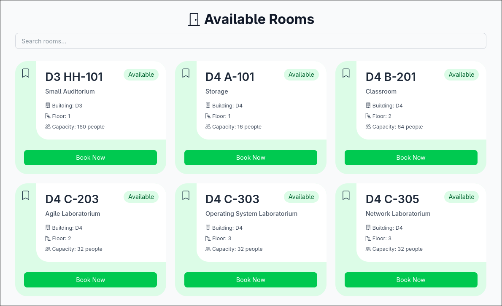

# Allocella - Frontend



<div style="text-align: center;">

   

</div>

## Description

Allocella is a room booking _web-app_. This is a repository to store Allocella's front-end program. To see the full profile or docs, go to [Allocella Docs Repository](ttps://github.com/Quackeyikz/2026-Allocella-docs). Using **React + Typescript + Vite**. This is the first time I learned about React and Typescript. _Not for production_.

> Educational purpose only.

## How to Run?

**Prequisities:** 
> [Backend](https://github.com/Quackeyikz/2026-Allocella-backend) and [Infrastructure](https://github.com/Quackeyikz/2026-Allocella-infrastructure) is **running**. Please refer to their side of tutorial before proceeding.

1. Clone this repository.
2. `cd 2026-Allocella-frontend`
3. `npm install`
4. Modify [.env](.env.example), add your API URL.
5. `npm run dev`
6. Open the URL in Browser.

## Packages Installation Documentation (Ignore)
You **aren't** have required to execute these commands. All packages installation is already covered in the `npm install` command.

1. Axios & React Router DOM.

    ```bash
    npm install axios react-router-dom
    ```
2. TailwindCSS, PostCSS, AutoPrefixer, TS Type definition, TailwindCSS Vite Type.

    ```bash
    npm install -D tailwindcss postcss autoprefixer @types/node @tailwindcss/vite
    ```
3. Bootstrap Icons

    ```bash
    npm install react-icons bootstrap-icons
    ```

## Contribution

It's just me. Good ol' Quackeyikz.